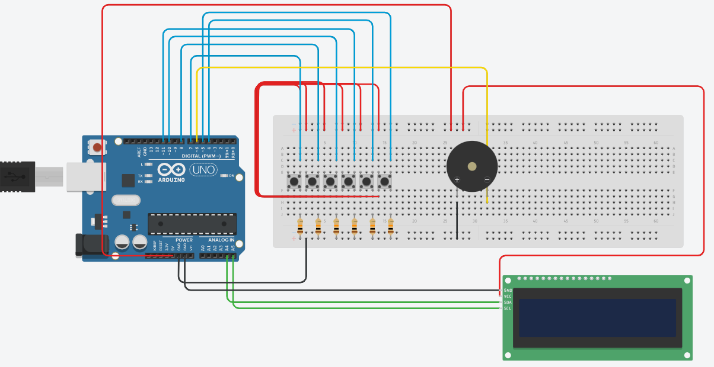

# Arduino clock without RTC.

In this repository we will create a arduino clock without RTC sensor. We will use a lcd to display the time, the date, a counter and also to set an alarm.Also we will use 6 pins to manually change the time, data and alarm. 

---
In the following image you can see how we connect the lcd and the pins to arduino. The scematics has been designed using tinkercad.

---
## Push Buttons.

You can use the pins to make changes to the system using the following rules:
- Push Button 1 changes the minutes.
- Push Button 2 changes the hours. 
- Push button 3 changes the days.
- Push button 4 changes the months. To change the years you must do it by pressing this button 12 times.
- Push button 5 and hold it, then  the second row of the lcd display changes to alarm. There by pressing the first button you increase the minutes and with the button 2 change hours for the alarm.
- Push button 6 and hold it, then  the second row of the lcd display changes to counter.

---
## Suggestions.
- You can improve the code by adding specific days to every month.
- The second row of the lcd, change only when we hold the Button 5(Alarm)
 and the Button 6 (Counter).
- You can increase the hours and minutes only by one in every second. 
=======
## Create a digital time clock with arduino and display the time. 
>>>>>>> a60e7cc715880d9f02a3ee12621926950e264f86
